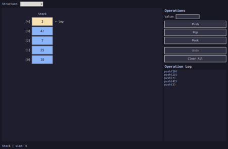
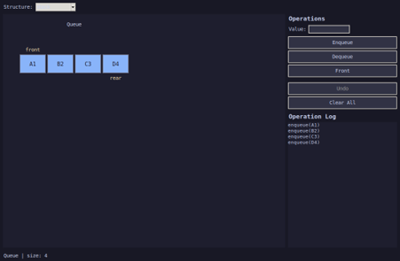
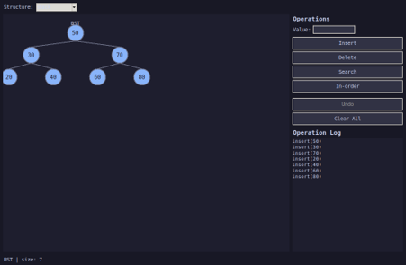

# Визуализация основных структур данных

Десктопное приложение для пошаговой визуализации трёх структур данных — стека, очереди и двоичного дерева поиска. Написано на Python с графическим интерфейсом на Tkinter.

Учебная ознакомительная практика · ФГБОУ ВО «ВВГУ» · группа БИС-24-3 · вариант А-04

---

## Содержание

- [Возможности](#возможности)
- [Скриншоты](#скриншоты)
- [Требования](#требования)
- [Установка и запуск](#установка-и-запуск)
- [Запуск в Docker](#запуск-в-docker)
- [Структура проекта](#структура-проекта)
- [Описание структур данных](#описание-структур-данных)
- [Тестирование](#тестирование)
- [Хранение данных](#хранение-данных)
- [Документация](#документация)

---

## Возможности

- Визуализация **стека** (LIFO): push, pop, peek
- Визуализация **очереди** (FIFO): enqueue, dequeue, front
- Визуализация **двоичного дерева поиска**: insert, delete, search, in-order обход
- **Механизм отмены** (Undo) для каждой операции
- **Журнал операций** с временными метками в JSON
- Переключение между структурами без потери данных
- Обработка граничных случаев: переполнение, пустая структура, дубликаты в BST
- Кроссплатформенность: Windows, Linux, macOS
- Контейнеризация через Docker

---

## Скриншоты

| Стек | Очередь | BST |
|------|---------|-----|
|  |  |  |

---

## Требования

- Python 3.11 или выше
- Tkinter (входит в стандартную поставку Python)
- pytest (только для запуска тестов)

---

## Установка и запуск

### 1. Клонировать репозиторий

```bash
git clone https://github.com/MaxiMM6/data-structures-visualizer.git
cd data-structures-visualizer
```

### 2. Установить зависимости

```bash
pip install -r requirements.txt
```

### 3. Запустить приложение

```bash
# Универсальный способ
python -m src.main

# Linux / macOS
bash scripts/run.sh

# Windows
scripts\run.bat
```

---

## Запуск в Docker


### Linux / macOS

```bash
docker build -t ds-visualizer .
docker run -e DISPLAY=$DISPLAY \
           -v /tmp/.X11-unix:/tmp/.X11-unix \
           ds-visualizer
```

### Через docker-compose

```bash
docker-compose up
```

---

## Структура проекта

```
data-structures-visualizer/
├── src/
│   ├── core/               # Алгоритмическое ядро (без GUI)
│   │   ├── stack.py        # Класс Stack
│   │   ├── queue.py        # Класс Queue
│   │   └── bst.py          # Классы BST и BSTNode
│   ├── visualization/      # Рисователи на Tkinter Canvas
│   │   ├── stack_drawer.py
│   │   ├── queue_drawer.py
│   │   └── bst_drawer.py
│   ├── controllers/        # Связь ядра с GUI, механизм Undo
│   │   ├── base_controller.py
│   │   ├── stack_controller.py
│   │   ├── queue_controller.py
│   │   └── bst_controller.py
│   ├── gui/                # Главное окно и компоненты интерфейса
│   │   ├── app.py
│   │   ├── controls.py
│   │   ├── operation_log.py
│   │   └── status_bar.py
│   ├── persistence/        # Логирование и конфигурация
│   │   ├── logger.py
│   │   └── config.py
│   └── main.py
├── tests/
│   ├── unit/               # Юнит-тесты ядра
│   │   ├── test_stack.py
│   │   ├── test_queue.py
│   │   └── test_bst.py
│   └── integration/        # Интеграционные тесты
│       └── test_gui_flow.py
├── data/
│   ├── logs/               # operations.log.json (создаётся автоматически)
│   └── config.json         # Настройки приложения
├── report/                 # Отчёт по практике
│   ├── Отчет_Практика_Жиляков_БИС-24-3.docx
│   └── Отчет_Практика_Жиляков_БИС-24-3.pdf
│   
├── scripts/
│   ├── run.sh
│   ├── run.bat
│   └── run_tests.py
├── img/                    # Скриншоты для README
│   ├── stack.png
│   ├── queue.png
│   └── bst.png
├── Dockerfile
├── docker-compose.yml
├── pytest.ini
├── requirements.txt
├── .gitignore
└── README.md
```

---

## Описание структур данных

### Stack — стек (LIFO)

| Метод | Описание | Сложность |
|-------|----------|-----------|
| `push(value)` | Добавить элемент на вершину | O(1) |
| `pop()` | Извлечь элемент с вершины | O(1) |
| `peek()` | Посмотреть вершину без удаления | O(1) |
| `is_empty()` | Проверить, пуст ли стек | O(1) |
| `size()` | Количество элементов | O(1) |
| `clear()` | Очистить стек | O(1) |

### Queue — очередь (FIFO)

| Метод | Описание | Сложность |
|-------|----------|-----------|
| `enqueue(value)` | Добавить элемент в конец | O(1) |
| `dequeue()` | Извлечь элемент из начала | O(n)* |
| `front()` | Посмотреть первый элемент | O(1) |
| `rear()` | Посмотреть последний элемент | O(1) |
| `is_empty()` | Проверить, пуста ли очередь | O(1) |
| `clear()` | Очистить очередь | O(1) |

\* реализовано через `list.pop(0)`; при ограничении в 20 элементов не критично

### BST — двоичное дерево поиска

| Метод | Описание | Средний случай | Худший случай |
|-------|----------|---------------|--------------|
| `insert(key)` | Вставить ключ | O(log n) | O(n) |
| `delete(key)` | Удалить ключ | O(log n) | O(n) |
| `search(key)` | Найти узел | O(log n) | O(n) |
| `inorder()` | Обход в порядке возрастания | O(n) | O(n) |

> Дерево не балансируется автоматически. При вставке отсортированной последовательности вырождается в список.

---

## Тестирование

```bash
# Запустить все тесты
python -m pytest tests -v

# Только юнит-тесты
python -m pytest tests/unit -v

# Только интеграционные тесты
python -m pytest tests/integration -v

# Через скрипт
python scripts/run_tests.py
```

### Результаты

| Набор тестов | Количество | Результат |
|---|---|---|
| Юнит-тесты Stack | 10 | ✅ PASS |
| Юнит-тесты Queue | 10 | ✅ PASS |
| Юнит-тесты BST | 15 | ✅ PASS |
| Интеграционные тесты | 6 | ✅ PASS |
| **Итого** | **41** | **✅ ALL PASS** |

---

## Хранение данных

### Журнал операций — `data/logs/operations.log.json`

Каждое действие пользователя записывается в JSON-массив:

```json
[
  {
    "operation": "push(42)",
    "timestamp": "2026-06-21T22:56:31"
  },
  {
    "operation": "pop() → 42",
    "timestamp": "2026-06-21T22:56:35"
  }
]
```

### Конфигурация — `data/config.json`

```json
{
  "animation_speed": 500,
  "color_scheme": "dark"
}
```

Файлы создаются автоматически при первом запуске.

---

## Документация

Полный отчёт по учебной практике доступен в форматах:

- [Отчёт (DOCX)](report/Отчет_Практика_Жиляков_БИС-24-3.docx)
- [Отчёт (PDF)](report/Отчет_Практика_Жиляков_БИС-24-3.pdf)

---

## Автор

**Жиляков Максим Николаевич** · группа БИС-24-3  
Руководитель: И.С. Можаровский  
ФГБОУ ВО «Владивостокский государственный университет», 2026
